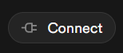
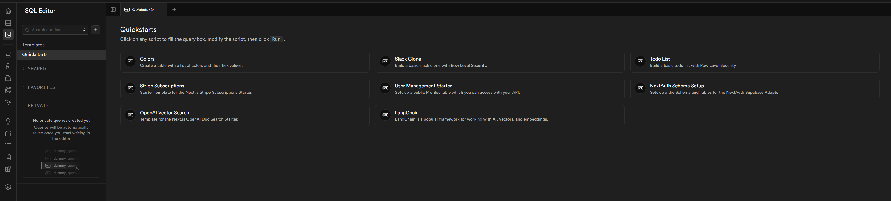

# Ultimate Next.js Starter Kit (Next.js, Supabase, ShadCN)

This is a comprehensive starter kit that combines Next.js, Supabase, and ShadCN to help you build modern web applications faster. It provides everything you need to get started with a production-ready foundation.

## 🚀 Features

### Core Technologies
- **Next.js 14**: The latest version of the React framework for production-grade applications
- **Supabase Authentication**: Pre-configured auth system with email/password, social logins, and session management
- **Supabase Database**: Postgres database with row-level security and real-time subscriptions
- **Supabase Blob Storage**: Image storage/binary file storage 
- **ShadCN UI Components**: A collection of beautifully designed, accessible components
- **TypeScript**: Full type safety and better developer experience
- **Tailwind CSS**: Utility-first CSS framework for rapid UI development

This template saves you hours of setup time and follows best practices for architecture and security. Perfect for building anything from MVPs to production applications.


## 📋 Prerequisites

Before you begin, ensure you have the following installed:

- **Node.js**: Version 18.17 or later
  - Download from [nodejs.org](https://nodejs.org/)
  - Recommended: Use nvm (Node Version Manager) for easier version management
- **npm**: Version 9.x or later (comes bundled with Node.js)
  - To check your versions:
    ```bash
    node -v && npm -v
    ```
- **Git**: Latest version recommended
- **Code Editor**: We recommend VS Code with these extensions:
  - ESLint
  - Prettier
  - Tailwind CSS IntelliSense

<br>

# 🏁 Getting Started

## 1. Clone and Install

```bash
# Clone the repository
git clone https://github.com/apensotti/ultimate-next-starter.git

# Navigate to the project directory
cd ultimate-next-starter

# Install dependencies
npm install
```

## 2. Supabase Setup

### 2.1 Supabase Environment Configuration
1. Create an account or login to [Supabase](https://supabase.com/)
2. Create a new organization (Personal/Free Plan works fine)
3. Create a new project and set up a secure database password
4. Create your local environment file:
    ```bash
    cp .env.example .env.local
    ```
5. Click `Connect > App Frameworks` to view your credentials

    

6. Copy the environment variables to your `.env.local`:
    ```bash
    NEXT_PUBLIC_SUPABASE_URL=YOUR_SUPABASE_URL
    NEXT_PUBLIC_SUPABASE_PUBLISHABLE_DEFAULT_KEY=YOUR_SUPABASE_PUBLISHABLE_DEFAULT_KEY
    ```

### 2.2 Supabase CLI Setup

The Supabase CLI helps you manage your project locally.

#### Connect Your Supabase Project

```bash
# Install Supabase CLI if you haven't already
npm install -g supabase-cli

# Link your project
supabase link --project-ref <project-id>

# You can find your <project-id> in your project's dashboard URL: 
# https://supabase.com/dashboard/project/<project-id>
``` 

# TODO: Adding auth providers in supabase

#### Database Setup *(Optional)*

If you want to use one of Supabase's quickstart templates:

1. Navigate to the SQL editor in your Supabase dashboard
2. Choose a quickstart template

 

3. Pull the database schema to your local environment:
 ```bash
 npx supabase db pull
 ``` 

## 🛠️ Development

Start the development server:

```bash
npm run dev
```

Open [http://localhost:3000](http://localhost:3000) with your browser to see the result.

### Key Development Notes:
- The main page is located at `app/page.tsx`
- The application features hot reloading - changes are reflected immediately
- This project uses [`next/font`](https://nextjs.org/docs/app/building-your-application/optimizing/fonts) to automatically optimize and load [Geist](https://vercel.com/font), a custom font family from Vercel

### ShadCN Customization
- Global styles are managed in `app/globals.css`
  - Theme variables are defined here (colors, spacing, etc.)
  - Default dark/light mode preferences
  - Custom utility classes
- Component customization:
  - Components are located in `components/ui/`
  - Modify component styles in their respective `.tsx` files
  - Use the `cn()` utility for conditional classes
- Theme configuration:
  - Update `components.json` for build settings
  - Modify `tailwind.config.js` for theme-wide changes
  - Use `themes.js` for custom theme definitions

## 🚀 Deployment

### Deploy to Vercel

The easiest way to deploy your Next.js app is to use Vercel, the platform from the creators of Next.js.

[](https://vercel.com/new/clone?repository-url=https%3A%2F%2Fgithub.com%2Fapensotti%2Fultimate-next-starter&env=NEXT_PUBLIC_SUPABASE_URL,NEXT_PUBLIC_SUPABASE_PUBLISHABLE_DEFAULT_KEY&envDescription=Required%20environment%20variables%20for%20the%20application.&envLink=https%3A%2F%2Fgithub.com%2Fapensotti%2Fultimate-next-starter%2Fblob%2Fmain%2F.env.example)

### Deployment Checklist
- Ensure all environment variables are properly set
- Run build locally to catch any issues: `npm run build`
- Configure your deployment platform's settings
- Set up proper CI/CD workflows if needed

## 📚 Learn More

### Next.js Resources
- [Next.js Documentation](https://nextjs.org/docs) - comprehensive feature guide
- [Learn Next.js](https://nextjs.org/learn) - interactive Next.js tutorial
- [Next.js GitHub Repository](https://github.com/vercel/next.js) - contribute to Next.js

### Additional Resources
- [Supabase Documentation](https://supabase.com/docs)
- [ShadCN UI Documentation](https://ui.shadcn.com/)
- [Tailwind CSS Documentation](https://tailwindcss.com/docs)
- [TypeScript Handbook](https://www.typescriptlang.org/docs/)

## 🤝 Contributing

Contributions are welcome! Please feel free to submit a Pull Request.

## 📝 License

This project is open source and available under the [MIT License](LICENSE).
